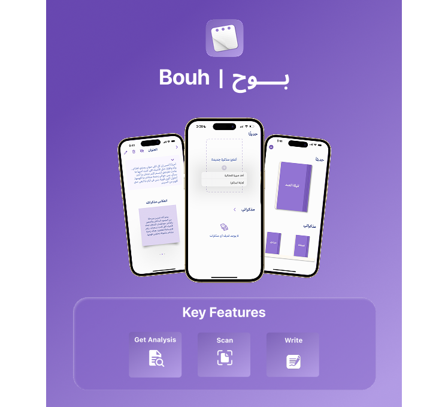

# 📝 Boah – Write, Express, and Save Your Emotions with Privacy and Smart Insights

  

**Boah** is an iOS application designed for young adults to express their emotions and thoughts freely through journaling and AI-powered analysis, all while maintaining complete privacy and emotional comfort.

---

## 💡 App Statement

> **An app for young adults that prompts them to write down their experiences and analyze their input using AI-powered tools to help make sense of scattered thoughts and emotions, empowering them to reach their ideal self.**

---

## ✨ Key Features

-  **Daily Writing:** Freely express your thoughts, feelings, or fragmented ideas without limitations.
-  **Privacy & Security:** Hide specific notes with Face ID or Touch ID to ensure maximum confidentiality.
-  **Smart Text Analysis:** Use AI to analyze your written entries and reflect on your emotional state with empathy.
-  **Scan & Convert:** Take a photo of handwritten notes and convert them to digital entries—your feelings always have a place here.

---

##  Technologies Used

-  **Core ML** – For processing and analyzing text using machine learning models.
-  **Vision Framework** – For extracting text from scanned images.
-  **LocalAuthentication** – To secure private notes with biometric authentication (Face ID / Touch ID).

---

## 👩‍💻 Contributors

- [@ghalaghaa](https://github.com/ghalaghaa)
